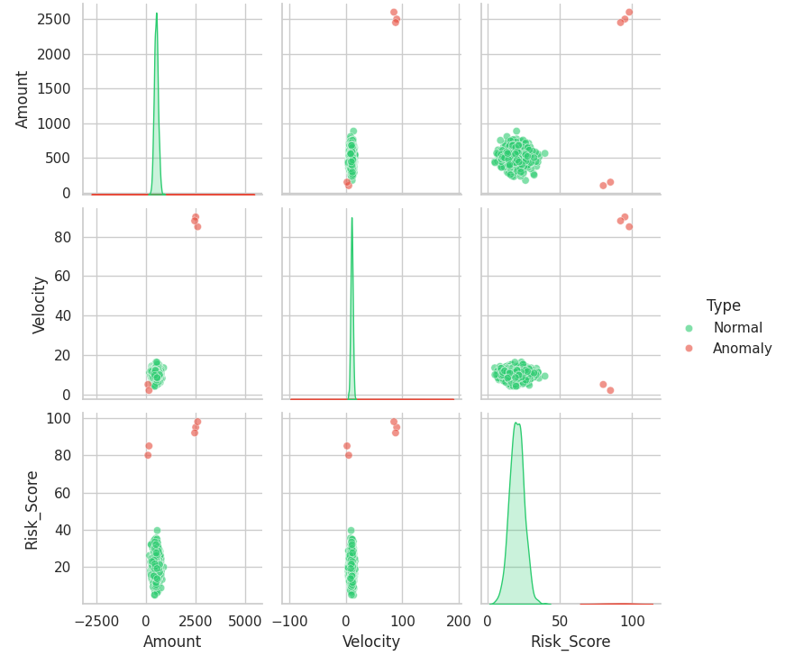

# Forensic-Anomaly-Analysis
Multi-dimensional anomaly detection and forensic data auditing using Python.
# Forensic Anomaly Analysis 
## Project Overview
This project demonstrates a "System Architect" approach to identifying Out-of-Distribution (OOD) anomalies in high-stakes datasets.

## Key Features
- **Synthetic Data Generation:** Simulates complex transaction environments.
- **Multivariate Analysis:** Uses Seaborn Pair Plots and KDE distributions.
- **Forensic Z-Score Profiling:** Isolates root causes of system failures.

## Visualizations

## Contact
If your company needs high-precision data auditing or AI safety research, reach out via [LinkedIn]( www.linkedin.com/in/testimony-oladayo-5530143a4).
